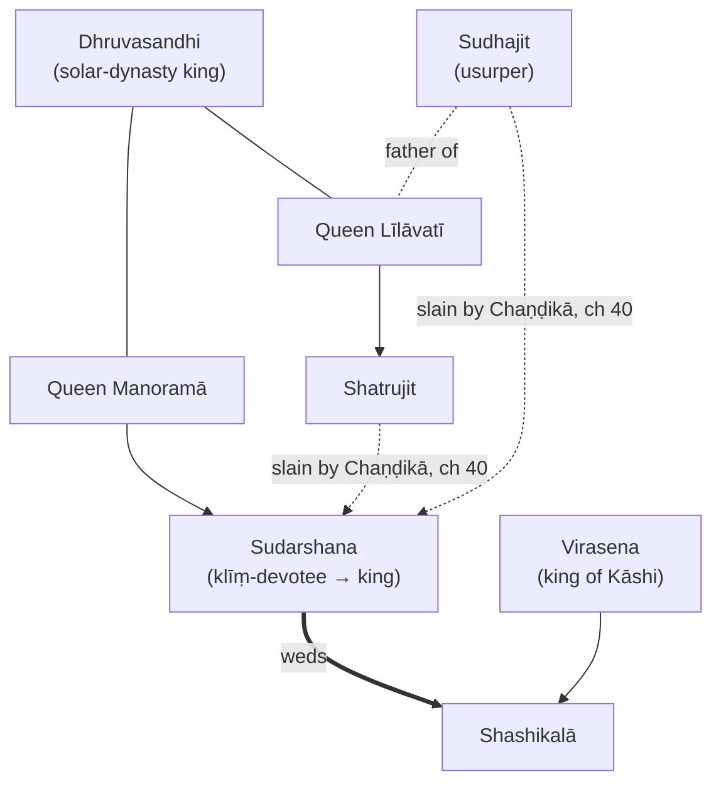
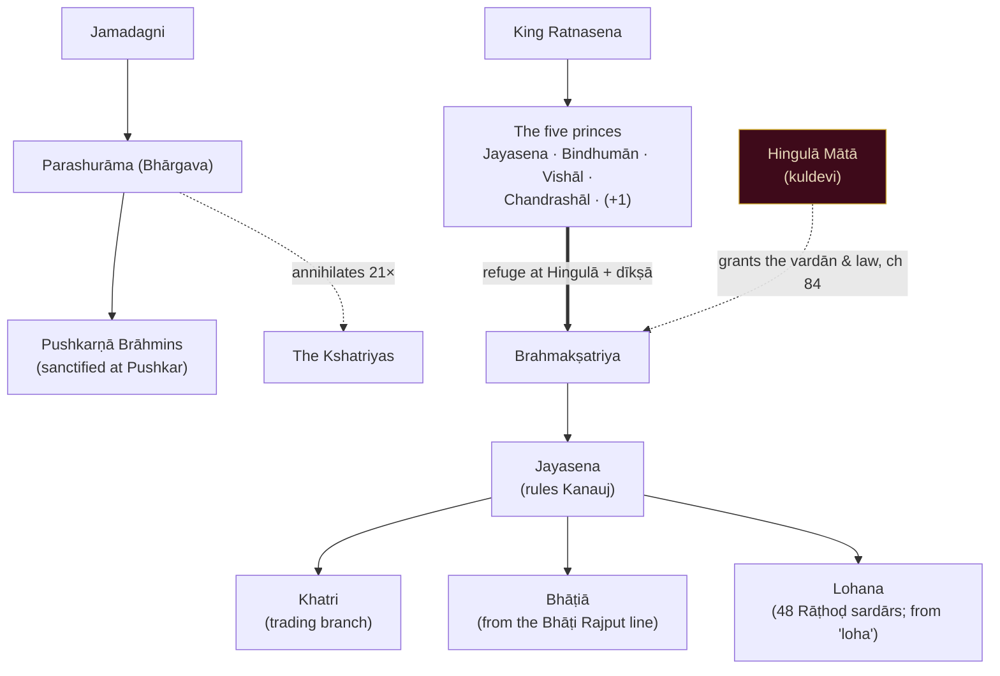

# Lineage & Genealogy Diagrams

> The two dynastic trees of the grantha, as renderable **Mermaid** diagrams (version-controllable; render on GitHub & most site frameworks). Detailed ch-85 dynastic names sit on a worn scan and are **tentative** — the reliable structure is given; flagged names await re-scan + pandit review (see SCAN-QUALITY-NOTES.md). A styled Mata-ni-Pachedi-palette SVG version can be produced for the site on request.

---

## 1 · The Sūrya-vaṃśa — the Sudarshana line *(ch 31–42)*
The Devi-Bhāgavata ākhyāna of the exiled prince who regains his throne by the *klīṃ* bīja.

**Outcome:** the rivals **Sudhajit & Shatrujit** are slain by **Chaṇḍikā** at the svayaṃvara-battle (ch 40); Sudarshana weds Shashikalā and **regains Ayodhyā** (ch 41–42).

---

## 2 · The Brahmakṣatriya line *(ch 73–86)*
How the surviving warriors became the Brahmakṣatriya and branched into the kuldevi communities.

**The thread:** Parashurāma's purge → the survivors take **refuge at Hingulā** → her **vardān & 1000-year law** (ch 84) → Jayasena's **mantra-dīkṣā** → the **Brahmakṣatriya**, branching into **Lohana / Bhāṭiā / Khatri / Pushkarṇā**, all bound to Hingulā as kuldevi.

> **Tentative (ch 85, worn scan):** the longer dynastic chain — *Vijaya · Bahushāla · Chandrasena · Dyutidhwaja · Ketumāla · Shrutasena · Viharsha…* and the founding of **Sohau-nagari** & **Champānagari** — needs the re-scan to render reliably. The structure above (Ratnasena → five princes → Jayasena → communities) is the firm part.

---
*Cross-refs: HINGLAJ-PURAN.md (ch 73–86), COMMUNITY-ORIGINS.md, GLOSSARY.md.*
